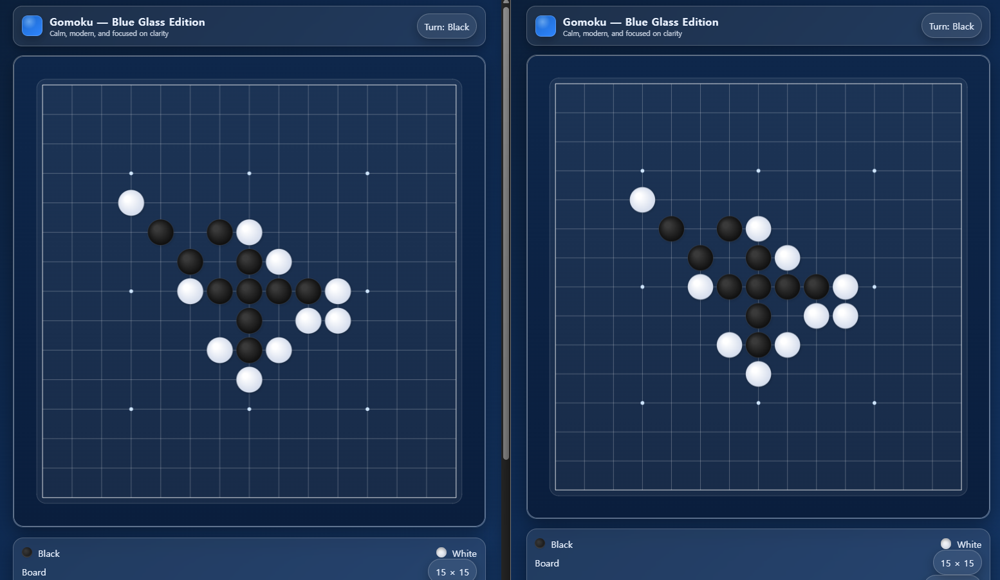

# Omock (오목 게임 백엔드 프로젝트)

이 프로젝트는 Python의 **FastAPI** 프레임워크와 **PostgreSQL** 데이터베이스를 사용하여 구현한 오목 게임 프로젝트입니다. 백엔드 개발 역량 강화를 위해 진행되었습니다.



<br>

## 주요 기능 (Features)
- **실시간 게임 플레이** : 웹소켓(WebSocket)을 활용하여 두 명의 플레이어가 실시간으로 게임을 진행할 수 있습니다.
- **게임 로직 처리** : 오목의 기본 규칙(금수, 오목 완성 등)을 서버에서 판단하고 처리합니다.
- **게임 기록 저장** : 게임 완료 시 게임 결과가 PostgreSQL 데이터베이스에 저장됩니다.(예정)
- **API 문서 자동 생성** : FastAPI의 기능을 활용하여 API 명세를 자동으로 생성하고 관리합니다.

---
<br>

## 기술 스택 (Tech Stack)
-   **Language**: `Python 3.10+`
-   **Framework**: `FastAPI`
-   **Database**: `PostgreSQL`
-   **Real-time Communication**: `WebSockets`
-   **ORM**: `SQLAlchemy`

---
<br>

## 실행 방법
로컬에서 실행하는 방법입니다.

**/backend** 라이브러리로 이동 후 아래 명렁어를 사용하여 FastAPI 개발 서버를 실행합니다.<br>
(필요한 경우 requirements 파일을 통해 환경을 구축합니다.)
```bash
uvicorn main:app --reload
```

<br>

**/frontend** 라이브러리로 이동해 아래 명령어를 사용해 Docker를 통해 프론트엔드 코드를 실행시켜 줍니다.
```bash
docker-compose up -d
```
이제 **localhost:3000** 주소를 통해 2개의 창을 실행해 실시간 대전을 진행할 수 있습니다.

---